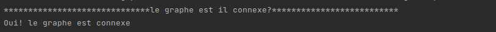
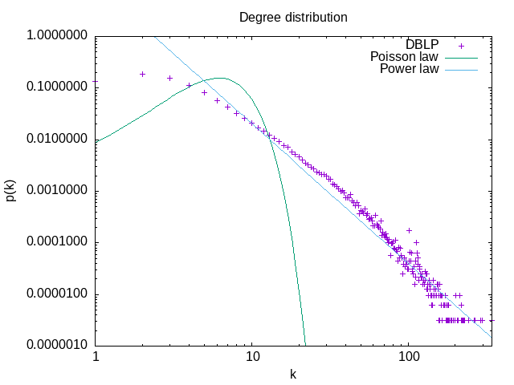
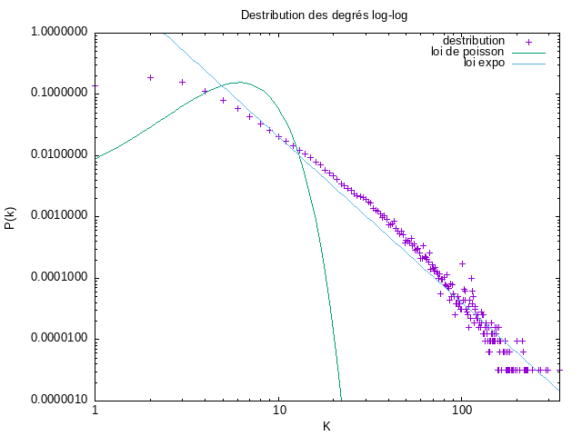
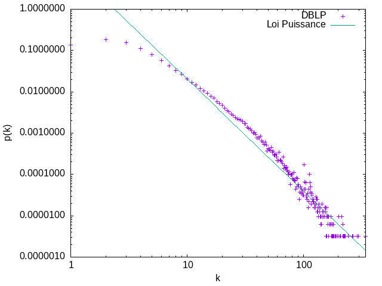
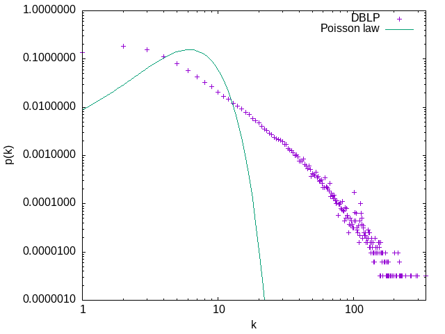

# MesuresDeRéseauxDinteraction

# Introduction

Nous allons analyser durant ce tp un réseau de collaboration scientifique en informatique.
Le réseau est extrait de DBLP, un réseau de co-auteurs où deux auteurs sont connectés (ce qui correspond aux liens ou arêtes) s'ils publient au moins un article ensemble, et donc chaque noeud représente un auteur qui publie.
Graphstream nous permettera de mesurer de nombreuses caractéristiques d'un réseau. Nous retrouveons la plus part de ces mesures implantées comme des méthodes statiques dans la classe Toolkit, que nous utiliseront par la suite.

# Mesures de base dans le réseau

1-1 Afin de débuter correctement ce TP, il était necessaire de télécharger le fichier : _com-dblp.ungraph.txt_  qui contient toutes les données de DBLP.  GraphStream a su lire ce format après l'instanciation de *FileSourceEdge* et via la fonction *readAll()* , l'integralité du fichier est lu en une seule instruction.
2-1 Pour calculer les mesures de base , comme cité precedemment j'ai utilisé les méthodes se trouvant dans la classe Toolkit .
On retrouve le nombre de noeuds , de liens, le degré moyen  ainsi que le coefficient de clustering via les fonctions *getNodeCount()*, *getEdgeCount()*, *averageDegree()* et *Toolkit.averageClusteringCoefficient* qui renvoient respectivement ;

# Mesures de base dans le réseau

Nombres de noeuds: **317080**

Le degré moyen est: **6.62208890914917**

Le coefficient de clustering: **0.6324308280637396*

coefficient de clustering pour un réseau aléatoire de la même taille et du même degré moyen :2.0884599814397534E-5 

# Connexité d'un graphe 

3-1 Oui! le réseau DBLP est connexe, la méthode *isConnected()* qui prend en paramètre notre graphe nous permet de vérifier si tous les noeuds sont connectés entre eux.
Dans le cas contraire,  elle renvoie false.  

3-2 Un réseau aléatoire malgré qu'il soit de la même taille et du même degré moyen ce dernier n'est pas connexe, il n'est pas vérifié dans son intégralité.  

3-3 Un réseau aléatoire avec cette même taille devient connexe si le degré moyen est supérieur à => **12.666909386951092**  

## Génération de fichier de données 

4-1 Ce fichier [Données_DistributionDegres](./ressources/donnee_distribution_des_degres.dat) contient les resultats obtenus pour la distribution des degrès, ces données sont tracées via l'outil Gnuplot, le graphe obtenu correspond donc à la probabilité qu'un sommet(noeud) choisi au hasard ait un degré k en fonction de k en échelle lineaire ainsi qu'en échelle log-log.   

*En echelle linéaire* ce [script](./ressources/plot_dd.gnu) a permit de tracer le graphe suivant :

*En echelle en log log* l'utilisation de ce [script](./ressources/plot_log_log.gnu) a permit de tracer ce graphe :

4-2 Oui, on observe une ligne droite en échelle log-log.  

4-3 **Analyse du graphe**:  

La ligne droite en échelle log-log signifie que la distribution des degrès suit une loi de Puissance.
P(k)= k-γ , où γ est une constante.  

4-4 **La loi de Puissance** :  
Afin de générer la loi de puissance que suit cette distribution , le même principe a été utilisé , via l'outil Gnuplot nous avons obtenu  grace au [script](./ressources/tracerPuissance.gnu) le graphe

**La distribution de Poisson** :  
Cette dernière a également été tracer via l'outil Gnuplot , ainsi que le [script](./ressources/tracerPoisson.gnu) , le graphe obtenu correspond a l'image

   

Selon les commande **fit** et **gnuplot** on voit  que `gamma=  2.70539  +/- 0.04437  (1.64%) `  .   

# Distance moyenne dans le réseau   

`Rappel => La distance entre deux noeuds d'un graphe est la longueur d'un plus court chemin entre ces deux noeuds. La longueur d'un chemin est sa longueur en nombre d'arrêtes. `  

5-1 Comme le calcul des plus courts chemins entre toutes paires de noeuds peut prendre plusieurs heures pour une telle taille de réseau, c'est pourquoi on se limitera  à un échantillon de 1000 noeuds choisis aléatoirement  en faisant un parcours en largeur.  

Pour permet de faire ce calcul, et les résultats obtenus sont stockés dans le fichier  [DataDistance](/dataDistance.dat) .  
Ces résultats sont tracés via Gnuplot grâce au [script](/tracer_distribution_distances.gnuplot) .  

Ce qui nous mène au graphe suivant

Nous obtenons egalement le résultat de la distance moyenne calculée pour 1000 sommets choisis au hasard qui est de => **6.787408571969219** .  

5-2 D'après la distance moyenne obtenue , en effet , l'hypothèse des six degrés de séparation est confirmée .  

5-3 Il s'agit également d'un réseau petit monde, car on obteint une plus courte distance entre deux noeuds aléatoires .  

5-4 La distance moyenne dans un réseau aléatoire avec les mêmes caractéristiques est de => **6.700611818856679** . 

5-5 **Analyse du graphe des distributions des distances**  

Dans la courbe obtenue on observe que selon les données du sommet on peut effectuer la remarque qu'il s'agit de la même distance que partage plusieurs noeuds.
Ainsi nous pouvons déduire que cette distribution suit bien une loi Binomiale.  