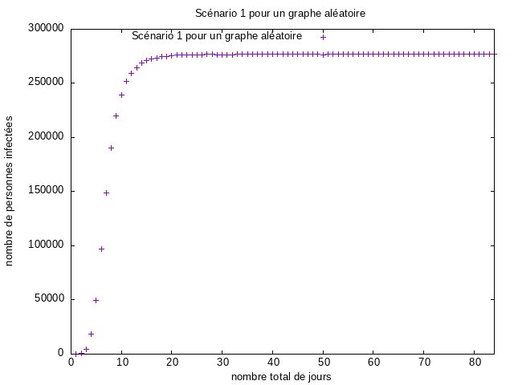

# MesuresDeRéseauxDinteraction

# Introduction

Nous allons analyser durant ce tp un réseau de collaboration scientifique en informatique.
Le réseau est extrait de DBLP, un réseau de co-auteurs où deux auteurs sont connectés (ce qui correspond aux liens ou arêtes) s'ils publient au moins un article ensemble, et donc chaque noeud représente un auteur qui publie.
Graphstream nous permettera de mesurer de nombreuses caractéristiques d'un réseau. Nous retrouveons la plus part de ces mesures implantées comme des méthodes statiques dans la classe Toolkit, que nous utiliseront par la suite.

# Mesures de base dans le réseau

1-1 Afin de débuter correctement ce TP, il était necessaire de télécharger le fichier : _com-dblp.ungraph.txt_  qui contient toutes les données de DBLP.  GraphStream a su lire ce format après l'instanciation de *FileSourceEdge* et via la fonction *readAll()* , l'integralité du fichier est lu en une seule instruction.
2-1 Pour calculer les mesures de base , comme cité precedemment j'ai utilisé les méthodes se trouvant dans la classe Toolkit .
On retrouve le nombre de noeuds , de liens, le degré moyen  ainsi que le coefficient de clustering via les fonctions *getNodeCount()*, *getEdgeCount()*, *averageDegree()* et *Toolkit.averageClusteringCoefficient* qui renvoient respectivement ;


# Mesures de base dans le réseau

Nombres de noeuds: **317080**

Le degré moyen est: **6.62208890914917**

Le coefficient de clustering: **0.6324308280637396**

coefficient de clustering pour un réseau aléatoire de la même taille et du même degré moyen :2.0884599814397534E-5

# Connexité d'un graphe

3-1 Oui! le réseau DBLP est connexe, la méthode *isConnected()* qui prend en paramètre notre graphe nous permet de vérifier si tous les noeuds sont connectés entre eux.
Dans le cas contraire,  elle renvoie false. </br>


3-2 Un réseau aléatoire malgré qu'il soit de la même taille et du même degré moyen ce dernier n'est pas connexe, il n'est pas vérifié dans son intégralité. </br>

3-3 Un réseau aléatoire avec cette même taille devient connexe si le degré moyen est supérieur à => **12.666909386951092** </br>


## Génération de fichier de données


4-1 Ce fichier [Données_DistributionDegres](./ressources/donnee_distribution_des_degres.dat) contient les resultats obtenus pour la distribution des degrès, ces données sont tracées via l'outil Gnuplot, le graphe obtenu correspond donc à la probabilité qu'un sommet(noeud) choisi au hasard ait un degré k en fonction de k en échelle lineaire ainsi qu'en échelle log-log on a utilsé [Toolkit.degreeDistribution()](https://data.graphstream-project.org/api/gs-algo/current/org/graphstream/algorithm/Toolkit.html#degreeDistribution(org.graphstream.graph.Graph)) pour obtenir $N_k$ et normaliser par la suite :</br>
   ```java
    int[] dd = Toolkit.degreeDistribution(graph);
    for (int k = 0; k < dd.length; k++) {
      if (dd[k] != 0) {
        System.out.printf(Locale.US, "%6d%20.8f%n", k, (double)dd[k] / graph.getNodeCount());
      }
    }
   ```

*En echelle linéaire* ce [script](./ressources/plot_dd.gnu) a permit de tracer le graphe suivant :


*En echelle en log log* l'utilisation de ce [script](./ressources/plot_log_log.gnu) a permit de tracer ce graphe :


4-2 Oui, on observe une ligne droite en échelle log-log. </br>

4-3 **Analyse du graphe**: </br>

La ligne droite en échelle log-log signifie que la distribution des degrès suit une loi de Puissance.
P(k)= k-γ , où γ est une constante. </br>

4-4 **La loi de Puissance** : </br>
Afin de générer la loi de puissance que suit cette distribution , le même principe a été utilisé , via l'outil Gnuplot nous avons obtenu  grace au [script](./ressources/tracerPuissance.gnu) le graphe


**La distribution de Poisson** : </br>
Cette dernière a également été tracer via l'outil Gnuplot , ainsi que le [script](./ressources/tracerPoisson.gnu) , le graphe obtenu correspond a l'image

  </br>

Selon les commande **fit** et **gnuplot** on voit  que `gamma=  2.70539  +/- 0.04437  (1.64%) `  .  </br>

# Distance moyenne dans le réseau  </br>

`Rappel => La distance entre deux noeuds d'un graphe est la longueur d'un plus court chemin entre ces deux noeuds. La longueur d'un chemin est sa longueur en nombre d'arrêtes. ` </br>

5-1 Comme le calcul des plus courts chemins entre toutes paires de noeuds peut prendre plusieurs heures pour une telle taille de réseau, c'est pourquoi on se limitera  à un échantillon de 1000 noeuds choisis aléatoirement  en faisant un parcours en largeur. </br>

Pour permet de faire ce calcul, et les résultats obtenus sont stockés dans le fichier  [DataDistance](./ressources/DataDistance.dat) . </br>
Ces résultats sont tracés via Gnuplot grâce au [script](./ressources/distance.gnu) . </br>

Ce qui nous mène au graphe suivant


Nous obtenons egalement le résultat de la distance moyenne calculée pour 1000 sommets choisis au hasard qui est de => **6.787408571969219** . </br>

5-2 D'après la distance moyenne obtenue , en effet , l'hypothèse des six degrés de séparation est confirmée . </br>

5-3 Il s'agit également d'un réseau petit monde, car on obteint une plus courte distance entre deux noeuds aléatoires . </br>

5-4 La distance moyenne dans un réseau aléatoire avec les mêmes caractéristiques est de => **6.700611818856679** .</br>

5-5 **Analyse du graphe des distributions des distances** </br>

Dans la courbe obtenue on observe que selon les données du sommet on peut effectuer la remarque qu'il s'agit de la même distance que partage plusieurs noeuds.
Ainsi nous pouvons déduire que cette distribution suit bien une loi Binomiale. </br>

# Générer un réseau aléatoire & et un réseau avec Barabasi-Albert </br>

Le modèle de Barabási–Albert (BA) est un algorithme pour la génération
aléatoire de réseaux sans échelle à l'aide d'un mécanisme d'attachement préférentiel.
On pense que plusieurs systèmes naturels ou humains, tel que l'Internet, le world wide web,
les réseaux de citations, et certains réseaux sociaux sont approximativement sans échelle. Ils contiennent en tout cas quelques nœuds (appelés hubs ou moyeux)
avec un degré inhabituellement élevé par rapport aux autres nœuds du réseau. Le modèle BA tente d'expliquer l'existence de tels nœuds dans de véritables réseaux. L'algorithme est
nommé d'après ses inventeurs Albert-László Barabási et Réka Albert et est un cas particulier d'un modèle plus général appelé modèle de Price

6-1 Afin de générer un réseau aléatoire, GraphStream nous le permet avec son générateur *RandomGenerator()* en précisant le nombre de noeuds et le degré moyen souhaité. Quant au nombre de liens, ceci varie
entre une réalisation et une autre. </br>


**Résultats** </br>

Le nombre de noeuds pour un graphe  généré aléatoirement => **317080** </br>
Le nombre de liens pour un graphe généré aléatoirement => **950399** </br>
Le degré moyen d'un graphe généré aléatoirement => **5.994563102722168** </br>
Connexité du graphe aléatoire => **false** </br>
Le coefficient de clustering d'un graphe généré aléatoirement => **3.7999301117284935E-5** </br>

Le [script](./ressources/tracer_dist_degree_graphe_alea.gnu) a permit le tracage du graphe de la distribution des degrés en echelle linéaire suivant


Egalement le [script](./ressources/tracer_dist_degree_alea_log.gnu) pour l'echelle en log log


6-2 Un graphe contenant le modèle de Barabasi-Albert est un graphe qui génère aléatoirement des réseaux sans échelle à l'aide d'un mécanisme d'attachement préférentiel permettant de connecter les noeuds.

Ce genre de graphe a été implémenté dans ce Tp , et en ayant les mêmes caractéristiques que le réseau DBLP on obtient les résultats suivants : </br>
Le nombre de noeud de ce graphe generer avec le generateur barbasi est => **317080** </br>
Le nombre de liens de ce graphe avec le generateur barbasi est =>**1110112** </br>
Degré moyen du graphe BAN => **7.002094268798828** </br>
Connexité du graphe aléatoire => **true** </br>
Le coefficient de clustering => **4.3767738485098553E-4**


Le [script](./ressources/tracer_dist_degree_graphe_BAN.gnu) a permit le tracage du graphe de la distribution des degrés en echelle linéaire suivant


Egalement le [script](./ressources/tracer_dist_degree_graphe_BAN_log.gnu) pour l'echelle en log log


# Comparaison


|                                     |                         DBPL |                                                                                                                                      Aléatoire |                                                                                                             Préférentiel |
|:------------------------------------|-----------------------------:|-----------------------------------------------------------------------------------------------------------------------------------------------:|-------------------------------------------------------------------------------------------------------------------------:|
| Nombre de noeuds : $`N`$            |                   $`317080`$ |                                                                                                                                     $`317087`$ |                                                                                                               $`317080`$ |
| Nombre de liens : $`L`$             |                  $`1049866`$ |                                                                                                                                     $`950399`$ |                                                                                                              $`1110112`$ |
| Degré moyen : $`\langle k \rangle`$ |         $`6.62208890914917`$ |                                                                                                                          $`5.994563102722168`$ |                                                                                                                     $`7.002094268798828`$ |
| Coefficient de clustering $`C_{i}`$ |                         $`2.0884599814397534E-5`$ |                                                                                                                                           $`3.7999301117284935E-5`$ |                                                                                                $`4.3767738485098553E-4`$ |
| Connexité                           |                          Oui |                                                                                                                                            Non |                                                                                                                      Oui |


D'après ce tableau de comparaison : on voit que le graphe préférentiel a plus de liens, concernant le graphe aléatoire c'est celui qui possède le plus faible coefficient de clustering . </br>
De plus le graphe ayant le mécanisme d'attachement préférentiel intègre deux concepts généraux importants : la croissance & l'attachement préférentiel. Et ces deux concepts existent tout deux largement dans les réseaux réels.
La croissance signifie que le nombre de noeuds dans le réseau augmente avec le temps . </br>
L'attachement préférentiel signifie que plus un noeud est connecté, plus il est suceptible de recevoir de nouveauc liens. </br>
Les noeuds avec un degré plus élevé ont une plus grande capacité à saisir les liens ajoutés au réseau.  </br>


# Rapport sur le TP3 : Propagation dans des réseaux

La communication entre les collaborateurs scientifique se fait généralement par mail. Et cela a malheureusement des incovenients dont les virus infirmatique pouvant être présents dans les pièces jointes de ces mails et donc une épidémie informatique se répand dans les sytèmes.</br>
Notre étude se basera donc sur la propagation de ce virus au sein du réseau tout en sachant que : </br>

un individu envoie en moyenne un mail par semaine à chacun de ses collaborateurs.
Un individu met à jour son anti-virus en moyenne deux fois par mois. Cela nettoie son système mais ne le protège pas de nouvelles infections car le virus mute.
L'épidémie commence avec un individu infecté (patient zéro).


# 1-1 Le taux de propagation du virus

Le taux de propagation d'un virus **λ** est le nombre moyen de cas secondaires provoqués par un seul individu infecté au cours d'une periode. C'est la propbabilité **P** de transmettre le virus pendant une certaine unité de temps diviser par le taux **µ** de guérissant des individus infectés.

=> **λ = \frac{P}{µ}** </br>
Où **P=1/7** => Probabilité de transmettre le virus à un collaborateurs vu qu'ils s'envoient en moyenne un mail par semaine. </br>
et **µ=1/14** => Probabilité qu'un individu mette à jour son anti virus vu qu'un individu nettoie et mets à jour son système en moyenne 2 fois par mois et celui -ci prend effet après 14 jours.</br>
Le taux de propagation serait donc :

**λ = \frac{P}{µ}** </br>
=> (1/7) / (1/14) = 2

# 1-2 Le seuil épidémique

Il est important de comprendre comment se propage une épidémie et analyser à partir de quel point une épidémie peut s'emballer. D'où l'importance du seuil épidémique et comme on voit bien que le taux de propagation ne dépond pas du réseau, on doit donc creser et chercher le seuil épidémique de ce réseau. </br>
Notons le seuil épidémique : `Sλ = <k> / <k²>` , où ``<k²>`` est la dispersion des degrés.

Et désormais si **λ > Sλ** =>  L'épidémie  se poursuit. </br>
si **λ < Sλ** =>  L'épidémie s'abstient. </br>

# 1-3 Comparaison des seuils epidemique

Nous ontenons les résultat suivants


Et donc => on voit que le seuil epidémique d'un réseau aléatoire au même degré moyen est approximativement = 0.1311 , plus élevé comparé a celui du réseau DBLP. Nous dire que cette différence est dûe à la divergence du degré de clustering.


# 2 - Simulation des scénarios
Dans cette partie on simule la propagation du virus jour par jour pendant 3 mois avec 3 différents scénarios. </br>

Pour commencer , on implémente la méthodes permettant de calculer et de retourner la distribution des degrés moyens nommée **k** ainsi que  2 méthodes permettant réspéctivement de retourner le nombre d'undividus positifs et les individus guéris en tenant compte de la probabilité de contaminer un collaborateur est de 1/7 et de mettre à jour l'anti virus est 1/14 . </br>


## 2-1 Scénario 1 : On ne fait rien pour empêcher l'épidémie

Via l'outil *Gnuplot* on trace un graphe qui represente l'evolution de la pandémie et sa propagation dans le systeme .</br>
Le [script](./ressources/s1.gnu) a permit de dessiner le graphe suivant:


Nous voyons clairement et très vite la propagation qui augmente d'une certaine vitesse notamment les 20 / 25 premiers jours de contamination, suivit d'une propagation constante.
Le premier scénario nous montre que le fait de ne rien faire a permit au virus de poursuivre sa contamination de se propager très rapidement dans le réseau.

La méthode implémentée pour ce scénario fut :

```java
   /**
 * Simulation du premier scénario : On ne fait rien pour empêcher l'épidémie
 */
public static void SimulationScenario1(Graph g) {
        // Selon les hypothèses l'épidémie comence avec un individu infecté qui est le patient 0
        Node n = g.getNode(0);
        n.setAttribute("infected", true);
        int nbPos = 1;
        //Comme il y'a 7 jours par semaine et que nos calculs se font sur 12 semaines => 7 x 12 = 84 d'où 84 jours
        for (int i = 1; i <= 84; i++) {
        for (Node s : g) {
        if (s.hasAttribute("infected")) {
        for (Edge e : s) {
        nbPos = patientPositif(e.getOpposite(s), nbPos);
        }
        }
        nbPos = patientNegatif(s, nbPos);
        }
        System.out.println(i + " " + nbPos);
        }
        }
```

## 2-2 Scénario 2 : On réussit à convaincre 50 % des individus de mettre à jour en permanence leur anti-virus (immunisation aléatoire)

Le 2ème scénario affecte moins les noeuds du réseau et afin de montrer ceci, ce [script](./ressources/s2.gnu) nous permet d'y voir plus clairement à travers le graphe suivant:


Où on observe une propagation importante les 20-25 premiers jours et devient stable par la suite.
En revenche on constate  que la propagation du virus a diminué dans le réseau lors de cette deuxième simulation. </br>

La méthode implémentée pour ce scénario fut :

```java
 /**
 * Simulation du 2ème scénario :On réussit à convaincre 50 % des individus de mettre à jour en permanence leur anti-virus (immunisation aléatoire).
 */
public static void SimulationScenario2(Graph g) {
        int nbImmunise = 0;
        for (Node s : g) {
        //on immunise aléatoirement la moitié de la population
        if ((int) (Math.random() * 2 + 1) == 1) {
        s.setAttribute("immunise", true);
        nbImmunise += 1;
        }
        }
        Node n = g.getNode(0);
        n.setAttribute("infected", true);
        int nbInfecte = 1;
        for (int i = 0; i < 84; i++) {
        for (Node s : g) {
        if (s.hasAttribute("infected")) {
        for (Edge e : s) {
        nbInfecte = patientPositif(e.getOpposite(s), nbInfecte);
        }
        }
        nbInfecte = patientNegatif(s, nbInfecte);
        }
        System.out.println(i + " " + nbInfecte);
        }

        double degreMoy = 0.0;
        double carredegreMoy;
        int somme = 0;
        for (Node s : g) {
        //Calcul du degré moyen
        if (!s.hasAttribute("immunise")) {
        degreMoy += s.getDegree();
        somme += Math.pow(s.getDegree(), 2);
        }
        }
        // Nombre de noeuds restants
        int nbNoeuds = g.getNodeCount() - nbImmunise;

        degreMoy /= nbNoeuds;
        carredegreMoy = (double) (somme / nbNoeuds);


        System.out.println("\n *********Résultats des mesures du réseau après la simulation du scénario 2  \n");
        System.out.println("Nombre de noeuds pouvant  être infectés  => " + nbNoeuds);
        System.out.println("Degré moyen après modification ( <k> ) => " + degreMoy);
        System.out.println("Degré moyen au carré après modification ( <k²> ) => " + carredegreMoy);
        System.out.println("Nouveau seuil épidémique du réseau après modification ( <k> / <k²> ) => " + (degreMoy / carredegreMoy));

        }

```


## 2-3 Scénario 3 : On réussit à convaincre 50 % des individus de convaincre un de leurs contacts de mettre à jour en permanence son anti-virus (immunisation sélective).

Avec l'outil *Gnuplot* , et grâce au [script](./ressources/s3.dat) , on obtient le graphique suivant :


**Analyse du graphe obtenu** => On voit que l'immunisation selective est plus efficace vu le nombre d'infectés, il est beaucoup plus réduit comparé aux deux autres scénarios .

La méthode implémentée pour ce scénario fut :

```java
 /**
 * Simulation du 3eme scénario : On réussit à convaincre 50 % des individus de convaincre
 * un de leurs contacts de mettre à jour en permanence son anti-virus (immunisation sélective).
 */
public static void SimulationScenario3(Graph g){
        //Compteur pour les individus immunisés
        int nbImmunise = 0;
        for(Node noeud : g) {
        //Si un voisin est immunisé on incrémente le compteur
        if ((int)(Math.random() * 2 + 1) == 1 ) {
        //Le voisin est choisi aléatoirement
        int voisinAleat = (int)(Math.random() );
        noeud.getEdge(voisinAleat).getOpposite(noeud).setAttribute("immunise", true);
        nbImmunise += 1;
        }
        }
        Node s = g.getNode(0);
        s.setAttribute("infected", true);
        int nbPos= 1;
        for(int i = 0; i<84; i++){
        for (Node n : g){
        if(n.hasAttribute("infected")){
        for(Edge e : n){
        nbPos = patientPositif(e.getOpposite(n), nbPos);
        }
        }
        nbPos = patientNegatif(n, nbPos);
        }
        //System.out.println("Jour "+ i + " nombre d'individus infectés : " + nbInfect + " nombre dindividus protégés : " + nbImmunise  );
        System.out.println(i +" "+ nbPos);
        }
        //Question 3
        double degreMoy = 0.0;
        double carreDegreMoy;
        int somme=0;
        for(Node n : g) {
        if(!n.hasAttribute("immunise")) {
        degreMoy += n.getDegree();
        somme += Math.pow(n.getDegree(), 2);
        }
        }
        // Nombre de noeuds restants
        int nbNoeuds = g.getNodeCount() - nbImmunise;
        degreMoy /= nbNoeuds;
        carreDegreMoy = (somme / nbNoeuds);

        System.out.println("\n *********Résultats des mesures du réseau après la simulation du scénario 3  \n");
        System.out.println("Nombre de noeuds pouvant  être infectés  => " + nbNoeuds);
        System.out.println("Degré moyen après modification ( <k> ) => " + degreMoy);
        System.out.println("Degré moyen au carré après modification ( <k²> ) => " + carreDegreMoy);
        System.out.println("Nouveau seuil épidémique du réseau après modification ( <k> / <k²> ) => " + (degreMoy / carreDegreMoy));
        }


```


## Simulation et utilisation des mêmes scénarios dans un réseau aléatoire et un réseau généré avec la méthode d'attachement préférentiel de la même taille et le même degré moyen

#### Scénario 1 pour un graphe aléatoire =>



#### Scénario 2 pour un graphe aléatoire =>


#### Scénario 3 pour un graphe aléatoire =>

*Note :* Pour ce scénario, à plusieurs reprise le résultat était égal à 0, il a donc fallut refaire et réexecuter plusieurs fois le scénario afin d'obtenir ce graphique.


####  => Scénario 1 pour un graphe BarabasiAlbert


#### Scénario 2 pour un graphe BarabasiAlbert =>


#### Scénario 3 pour un graphe BarabasiAlbert =>

*Note :* Pour ce scénario, à plusieurs reprise le résultat était égal à 0, il a donc fallut refaire et réexecuter plusieurs fois le scénario afin d'obtenir ce graphique.


                     


